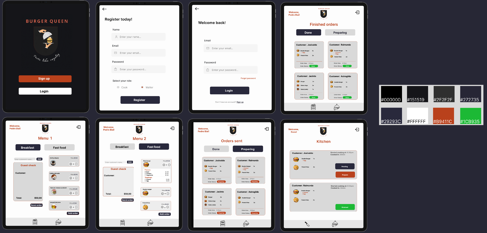

# Burger Queen

***
<em>
Status:</em> Em desenvolvimento

<em>Ferramentas:</em>  
<code></code>
<code></code>
<code></code>
<code></code>
<code></code>
   
<code></code>
<code></code>
<code></code>
<code></code>
<code></code>
<code></code>

## Índice

* [1. Introdução](#1-introdução)
* [2 Resumo do projeto](#2-resumo-do-projeto)
* [3. Organização do projeto](#3-organização-do-projeto)
* [4. Histórias de usuários](#4-histórias-de-usuários)
* [5. Protótipos](#5-protótipos)
* [6. Ferramentas](#6-ferramentas)

***

## 1. Introdução
Burger Queen API Client foi o quarto projeto desenvolvido durante o bootcamp da Laboratória, cujo objetivo principal era o desenvolvimento de um sistema de comandas digital para um restaurante (fictício).
O projeto foi desenvolvido através de consumo de uma [Rest API](https://lab-api-bq.onrender.com/api-docs/), e com o framework [React](https://reactjs.org/). 
O objetivo de aprendizagem principal do projeto foi de aprender a construir uma _interface web_ usando o
_framework_ React, aprendendo **como manter a interface e estado sincronizados**, e sobre o conceito de _estado da tela_, e como cada mudança no estado vai refletir na interface.

O processo de desenvolvimento englobou práticas chaves no desenvolvimento de um produto, desde o planejamento ao código; incluem-se metodologias ágeis, product design, storytelling, user stories, prototipação, versionamento de código, testes unitários e integração entre interface e servidor.  

## 2. Resumo do projeto
Um pequeno restaurante de hambúrgueres, que está crescendo, necessita uma
interface em que se possa realizar pedidos utilizando um _tablet_, e enviá-los
para a cozinha para que sejam preparados de forma ordenada e eficiente. Este projeto tem duas áreas: interface (cliente) e API (servidor), cujo principal objetivo é o desenvolvimento de uma interface que se integre com uma API.

Foi planejado e desenvolvido para atender demandas de um cliente, o restaurante **Burger Queen**. 

### 2.1 Burger Queen
Como um fast food 24 horas, o restaurante oferece dois tipos de serviço: café da manhã e convencional, com cardápio de hambúrguers. 

**Necessidade apresentada pelo restaurante:** 
>A nossa proposta de serviço 24 horas foi muito bem recebida e, para continuar a
>crescer, precisamos de um sistema que nos ajude a receber pedidos de nossos
>clientes.

**Problema resolvido pela aplicação:**
>A interface deve mostrar os dois menus (café da manhã e restante do dia), cada
>um com todos os seus _produtos_. O usuário deve poder escolher que _produtos_
>adicionar e a interface deve mostrar o _resumo do pedido_ com o custo total.

## 3. Organização do projeto
Seguindo uma proposta de desenvolvimento ágil, a organização do projeto contou com uma série de práticas de Scrum. 
O tempo de desenvolvimento foi estipulado por sprints, as quais foram divididas semanalmente, contando com cerimônias de retrospectiva, demo e planning. 

As restropectivas foram feitas nas plataformas Miro e Metroretro, utilizando retro dashboard; avaliávamos a sprint passada com um olhar de crescimento: analisando o que funcionou e o que não, o que faltou, o que foi bom, e criano planos de ações para a próxima. 

O planejamento foi feito através da plataforma Trello, utilizando kanban board; com estruturação lógica de tasks, divisão de tasks a partir de features, definição de prioridades conforme uma média de valor x esforço demandados por determinada feature, e gerenciamento de trabalho colaborativo (fizemos pair programming para resolvermos problemas juntas, e aplicação de code review quando trabalhávamos individualmente).

As sprints foram programadas e planejadas conforme as demandas das histórias de usuários.

## 4. Histórias de usuários
Desenvolvemos as features da aplicação conforme demandas presentes nas histórias de usuários disponibilizadas pela Laboratória, de modo que precisamos concluir a anterior para iniciar a próxima, tendo atendido os seguintes critérios gerais:

* Receber _code review_ de pelo menos uma parceira;
* Fazer _testes_ unitários e testar o produto manualmente;
* Aplicar _testes_ de usabilidade e incorporar o _feedback_ do usuário;
* Fazer deploy do aplicativo e marcar a versão (git tag).

Este projeto contou com quatro diferentes histórias de usuários, cada uma tendo determinados critérios mínimos de aceitação para ser concluída.

#### [História de usuário 1] Garçom/Garçonete deve poder entrar no sistema:

>*"Eu, como garçom/garçonete quero entrar no sistema de pedidos."*

**História 1: Critérios de aceitação**

* Acessar uma tela de login;
* Inserir email e senha;
* Receber mensagens de erros compreensíveis, conforme o erro e as informações inseridas;
* Entrar no sistema de pedidos caso as credenciais forem corretas

#### [História de usuário 2] Garçom/Garçonete deve ser capaz de anotar o pedido do cliente:

>*"Eu como garçom/garçonete quero poder anotar o pedido de um cliente para não*
>*depender da minha memória, saber quanto cobrar e poder enviar os pedidos para a*
>*cozinha para serem preparados em ordem."*

**História 2: Critérios de aceitação**

* Anotar o nome do cliente;
* Adicionar produtos aos pedidos;
* Excluir produtos;
* Ver resumo e o total da compra;
* Enviar o pedido para a cozinha (guardar em algum banco de dados);
* Funcionar bem em um _tablet_.

#### [História de usuário 3] Chefe de cozinha deve ver os pedidos:

>*"Eu como chefe de cozinha quero ver os pedidos dos clientes em ordem, poder*
>*marcar que estão prontos e poder notificar os garçons/garçonetes que o pedido*
>*está pronto para ser entregue ao cliente."*

**História 3: Critérios de aceitação**

* Ver os pedidos ordenados à medida em que são feitos;
* Marcar os pedidos que foram preparados e estão prontos para serem servidos;
* Ver o tempo que levou para preparar o pedido desde que chegou, até ser marcado como concluído.

#### [História de usuário 4] Garçom/Garçonete deve ver os pedidos prontos para servir:

>*"Eu como garçom/garçonete quero ver os pedidos que estão prontos para entregá-los*
>*rapidamente aos clientes."*

**História 4: Critérios de aceitação**

* Ver a lista de pedidos prontos para servir;
* Marcar os pedidos que foram entregues.

## 5. Protótipos
Nosso processo de prototipação abarcou o desenvolvimento de protótipos de baixa fidelidade, seguidos de versões de alta fidelidade e navegáveis. Criamos os protótipos com base em fluxogramas de telas, com o intuito de proporcionar uma experiência de manipulação acessível e simples para nossos usuários, considerando o contexto movimentado de um restaurante. 

Utilizamos a plataforma de design digital Figma para o desenvolvimento dos protótipos finais com as versões navegáveis, através dos quais aplicamos testes de usabilidade para atestar o nível de intuição na utilização de nossa aplicação, e implementamos mudanças necessárias conforme o feedback recebido.

Devido à necessidade de a aplicação ser feita para tablet, nosso protótipo foi pensado a partir deste tipo de tela, de modo que trabalhamos uma perspectiva de design responsivo. 

Finalmente, nosso protótipo conta com oito tipos de telas, sendo as quais: página principal, de acesso imediato; páginas de cadastro e de login, as quais redirecionam para as páginas de menu (se o usuário for um garçom ou garçonete) e de cozinha (se o usuário for um ou uma chef); página de acompanhamento de pedidos em andamento e concluídos, acessível para ambos tipos de funcionários. 

**Resultado final:**

## 6. Ferramentas
* [npm-scripts](https://docs.npmjs.com/misc/scripts)
* [Babel](https://babeljs.io/)
* [webpack](https://webpack.js.org/)
* React
* Postman
* Rest API
* Jest
* Figma
* Trello, Miro e Metroretro

### Deploy

* Veja a documentação [de deploy do Create React App](https://create-react-app.dev/docs/deployment).
Você pode utilizar qualquer um dos serviços listados na documentação,
sendo recomendado o Firebase, Vercel, Netlify, Github Pages ou Heroku.
